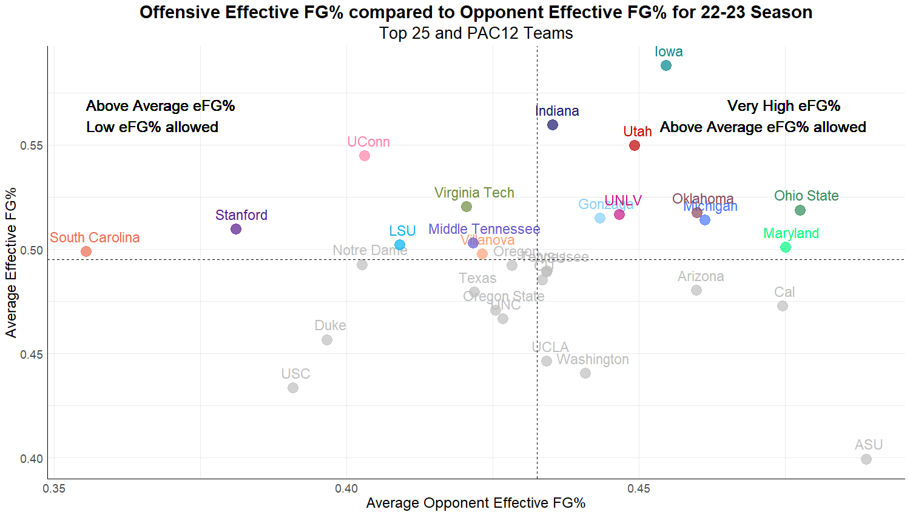

## Project for Women's Basketball Team Performance Analysis

**Project description:** This project was completed for an elite collegiate Women's Basketball team with the intention of analyzing performance across their very successful season. The main question we were trying to explore was "How can we help get the team to the next level"? To achieve this goal we worked to identify trends, patterns, and relationships between gameday statistics and corresponding training load from the week leading up to the game. In this, the initial questions we were trying to answer and goals we wanted to achieve were as follows:
* How can we leverage sports science data to enhance gameday box score performance?
  * Explore the impact of linking sports science data with game performance
* What insights can we derive from the relationship between gameday statistics and the training load leading up to a game?
  * Inform decision-making for practices during game-weeks

This analysis was initially completed for the 22-23 Women's Basketball season and then rerun with additional considerations for the 23-24 season to determine what differentiating factors may exist between the performance across the two seasons.

### 1. Data Description

The data sources used for this project were:

*Catapult Data:* Data from player worn catapult units, including accelerations, decelerations, and player workload, were the main source of our performance and training load metrics. In the data aggregation process for the Catapult data, we decided to exclude data from game days because competition is not comparable to practices and could potentially skew the results due to the wide variability in playing minutes throughout the team.

*In-game metrics and player statistics:* To aggregate in-game metrics and important player statistics we used two different data sources. The first data source had box score metrics and advanced statistics generated from a program that the basketball staff utilized to review team and individual performance. The output of this program was PDF files for which I wrote a script that extracted all necessary information and created structured dataframes that held both the individual and team statistics. The second data source used was Sports Reference which is a widely used public game statistics database that we used to supplement the team stats that we already had available to us.

*Force Plate Data:* Data was collected from countermovement jumps that were performed on Vald Forcedecks throughout the course of the season, including force, power, and fatigue metrics. While Force Plate metrics were used for some of the initial analysis on fatigue, they were not used as extensively as the other data sources due to limited testing both in the consistency of the tests across the season and the fact that we only had one season of data to work with. After a second season of Force Plate metrics were collected, we did rerun the analysis with weekly athlete jump testing metrics included in a larger capacity than the original analysis we conducted following the 22-23 season.

### 2. Project Process

* Clean and aggregate Sports Science data sources
* Exploratory data analysis of various data sources and data manipulation
* Regression Model on Wins and Losses
* Cluster Analysis of top 25 teams in the country and PAC12 teams
* Creation of all encompassing Over and Underperformance metric
* Team Catapult Analysis
* Significance Testing on difference in means between Team Catapult metrics based on Performance Metric
* Results and Findings
* Final Applications and presentation to Sports Science and Performance Staff
* Applied similar process to analyze multiple seasons of data after conclusion of 23-24 season

### 3. Analysis in R Studio

**Exploratory Data Analysis**

**Regression Model on Wins and Losses**

We used Sports Reference stats from the AP Top 25 Women's Basketball programs and PAC12 teams by game containing the following in-game statistics; Pace, 3 Point Attempt rate (3PAr) , Assist %, Both team’s Effective Field Goal % (EFG%), Offensive Rebounding % (ORB%) and Defensive Rebounding % (DRB%) among others. We also added the NCAA's NET Rank for each team to the dataset to account for differences in strength of schedule among the teams. Our initial regression used these metrics to predict wins and losses for all of the top teams and those in the PAC12 to determine which metrics had a significant relationship with game outcome. This model did very well at predicting wins and losses for these teams so we used this as a benchmark for our next regression model which was only created and tested on teams that were found to be similar to the team we were analyzing through the cluster analysis below.

**Cluster Analysis**

The main purpose behind creating a cluster model was to determine if significant metrics that influenced wins and losses changed if only teams that played similar styles to the team of interest were considered. We believed that if teams were split into groups according to their style of play than different statistics would become more important as determinants of success, which turned out to be true. Each of the three clusters had differentiating qualities, such as one cluster with a lot of success on the offensive side compared to another that relied on their defense to get results. 

**Creation of Over and Underperformance metric**

After creating regression models to predict game outcome in terms of wins and losses, we decided that only looking at performance through the lens of wins and losses may be limited as it does not account for the variation in wins, such as when the team plays very well compared to games where they get the result but there is still room for improvement. We wanted to address the variation of performance in wins for this team specifically because they were a very high performing team with very few losses across the season. For this reason, we created our own under/overperformance metric that allowed for wins to still be classified as 'underperformances' if the team did not exceed their season average of specific stats.

**Team Catapult Analysis**

**Significance Testing**

### 4. Conclusions

**Results and Findings**

**Applications and Conclusions**

For more details on the code related to this project see my [Women's Basketball Analysis GitHub Repository](https://github.com/jadegosar/WBB_Analysis).
