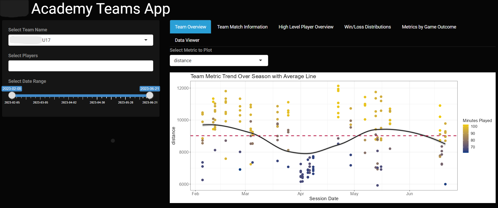
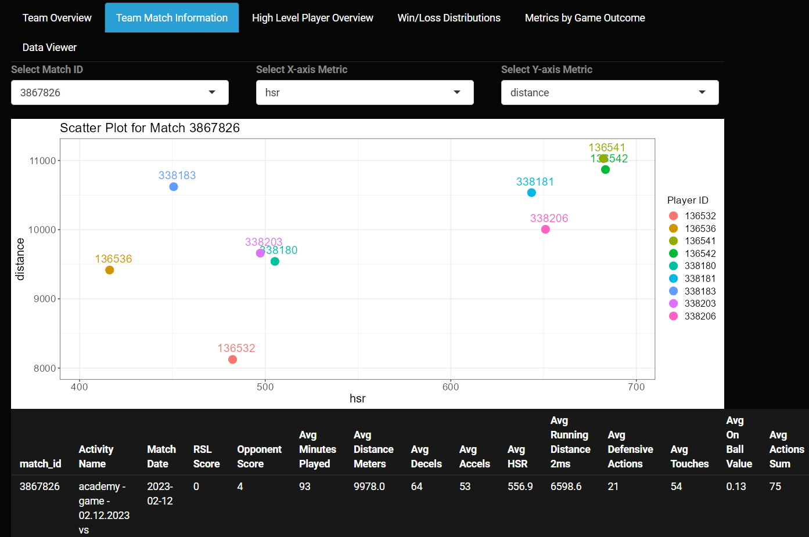

# Data Science and Analytics Portfolio

---

## Sport Science and Performance Analysis Projects

[Collegiate Men's Basketball Team KPI Reporting](https://github.com/jadegosar/Collegiate_MBB_KPI_Reporting)

<small>Project completed for a DI Collegiate Mens Basketball Team with the purpose of identifying and flagging players who may be physically unprepared for the game and therefore at an increased
risk of injury due to fatigue.</small>

---
[Collegiate Women's Basketball Team Performance Analysis](/pdf/WBB_Presentation.pdf)

<small>Project completed for a DI Collegiate Womens Basketball Team with the purpose of...</small>

---
[Collegiate Women's Soccer Season Analysis](/sample_page.md)

<small>Project completed for a DI Collegiate Mens Basketball Team with the purpose of...</small>

---
[Boys Academy Soccer Team App](http://example.com/)

<small>Project completed for Development Academy boys' soccer teams to give the Sport Scientist the ability to visualize game level data based on the team selected. This RShiny App
provides the opportunity for the client to look at team level metrics as well as filter for specific player performance. Additionally it provides the distributions of KPIs based on game outcome and
the option to view the underlying dataset based on the applied filters.</small>

---

## Sports Analytics Projects

[Predicting Player Impact in NBA Games](https://github.com/jadegosar/Predicting_NBA_Team_Wins)

---
[Super Team or Super Dream?](http://example.com/)

---
[NBA Shot Efficiency Dashboard in Tableau](http://example.com/)

---
[Miles traveled by Collegiate Sport Team](http://example.com/)

---
[Project 5 Title](http://example.com/)

---

## Projects in Python

- [Recipe Manager Program](http://example.com/)
- [Webpage Scraping](http://example.com/)
- [Converting PDFs to Structured Data](http://example.com/)
- [Project 4 Title](http://example.com/)
- [Project 5 Title](http://example.com/)

---

## Business Analytics and KPI Reporting

[Maverik Case Competition](https://github.com/jadegosar/Maverik-Case-Competition)

<small>This project was completed as a part of the Masters of Science in Business Analytics program at the University of Utah in the final Capstone course. Maverik was the sponsor of the case competition in which we were tasked with providing accurate forecasts for a new store's first year of sales in four major product categories.</small>

---
[Determining Default Risk for Loan Company](https://github.com/jadegosar/Home_Credit_Default_Risk)

<small>The objective of this project was to create a supervised analytical model to help Home Credit predict how capable each applicant is of repaying a possible loan, giving them the ability to intervene before borrowers default and reach an underserved population.</small>

---
[Forbes Top 2000 Companies of 2017 Dashboard](http://example.com/)

---
[Text Analytics Project](http://example.com/)

---
[Machine Learning Project](http://example.com/)

---

---

Page template forked from <a href="https://github.com/evanca/quick-portfolio">evanca</a>

<!-- Remove above link if you don't want to attibute -->
