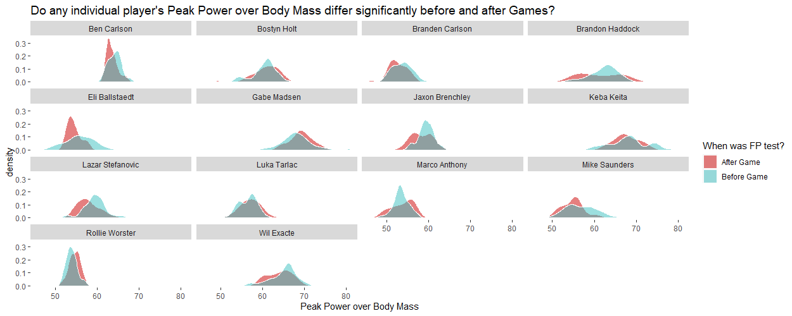
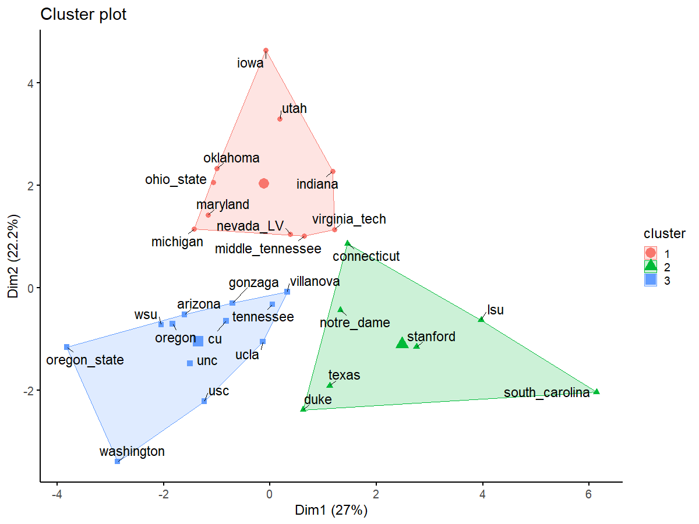
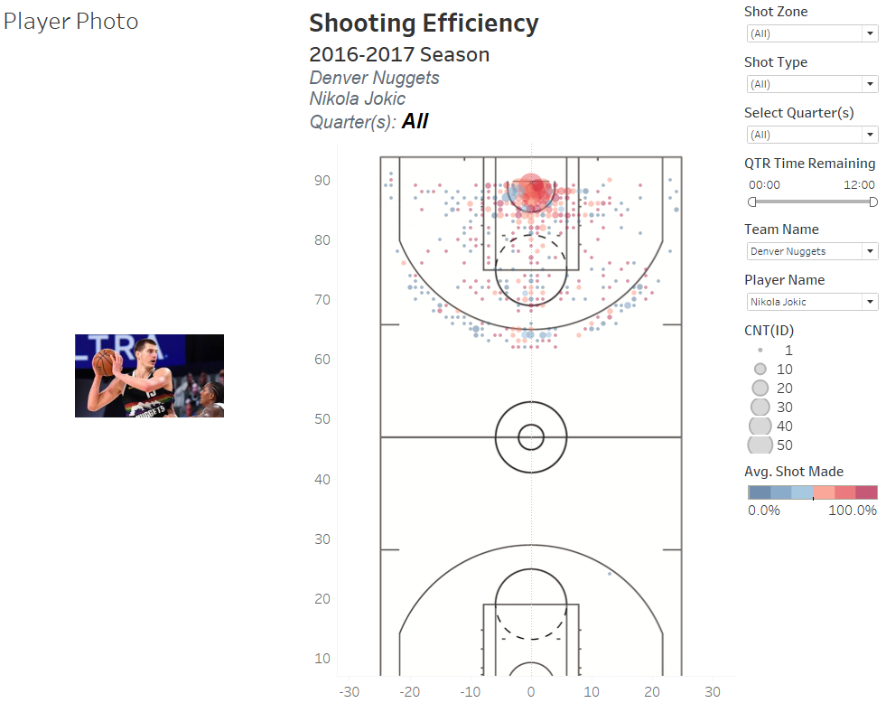
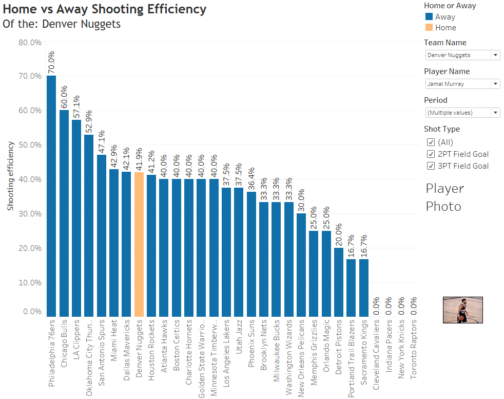

# Data Science and Analytics Portfolio

---

## Sport Science and Performance Analysis Projects

[Boys Academy Soccer Team App](/soccer_app_page.md)

<small>Project completed for Development Academy boys' soccer teams to give the Sport Scientist the ability to visualize game level data based on the team selected. This RShiny App
provides the opportunity for the client to look at team level metrics as well as filter for specific player performance. Additionally it provides the distributions of KPIs based on game outcome and
the option to view the underlying dataset based on the applied filters.</small>

---
[Collegiate Men's Basketball Team KPI Reporting](/mens_bball_project.md)

<small>Project completed for a DI Collegiate Mens Basketball Team with the purpose of identifying and flagging players who may be physically unprepared for the game and therefore at an increased risk of injury due to fatigue.</small>

---
[Collegiate Women's Basketball Team Performance Analysis](https://github.com/jadegosar/WBB_Analysis)

<small>Project completed for a DI Collegiate Womens Basketball Team with the purpose of...</small>

---
[Collegiate Women's Soccer Season Analysis](/pdf/sample_presentation.pdf)

<small>Project completed for a Collegiate Women's Soccer Team with the purpose of...</small>

---

## Sports Analytics Projects

[Predicting Player Impact in NBA Games](/human_performance_analytics_project.md)

<small>Machine Learning project to predict the true impact of an NBA player on eventual game outcome using point differential. This was a group project completed as part of the Human Performance Analytics class that I had the opportunity to take in my undergrad education at the University of Notre Dame.</small>

---
[Super Team or Super Dream?](/pdf/NBA_ML_Analysis.pdf)

<small>Machine Learning project to predict an NBA's team wins in the upcoming season based on updated rosters from off-season player movement. The GitHub Repo with more detailed project information can be [found here](https://github.com/jadegosar/Predicting_NBA_Team_Wins)</small>

---
[NBA Shot Efficiency Dashboard in Tableau](https://github.com/jadegosar/Tableau_Projects)

<small>Tableau dashboard to visualize NBA player shot profiles and shooting efficiency based on away and home games played in a season.</small>

---
[Project 4 Title](http://example.com/)

---
[Project 5 Title](http://example.com/)

---

## Projects in Python

- [Recipe Manager Program](http://example.com/)
- [Webpage Scraping](http://example.com/)
- [Converting PDFs to Structured Data](http://example.com/)
- [Project 4 Title](http://example.com/)
- [Project 5 Title](http://example.com/)

---

## Business Analytics and KPI Reporting

[Maverik Case Competition](https://github.com/jadegosar/Maverik-Case-Competition)

<small>This project was completed as a part of the Masters of Science in Business Analytics program at the University of Utah in the final Capstone course. Maverik was the sponsor of the case competition in which we were tasked with providing accurate forecasts for a new store's first year of sales in four major product categories.</small>

---
[Determining Default Risk for Loan Company](https://github.com/jadegosar/Home_Credit_Default_Risk)

<small>The objective of this project was to create a supervised analytical model to help Home Credit predict how capable each applicant is of repaying a possible loan, giving them the ability to intervene before borrowers default and reach an underserved population.</small>

---
[Forbes Top 2000 Companies of 2017 Dashboard](http://example.com/)

---
[Text Analytics Project](https://github.com/jadegosar/World_Cup_Tweets)

<small>Text Analytics project to contextualize important topics and sentiment throughout the Men's World Cup in 2022 by analyzing tweets related to the World Cup.</small>

---
[Machine Learning Project](http://example.com/)

---

---

<!-- Remove above link if you don't want to attibute -->
