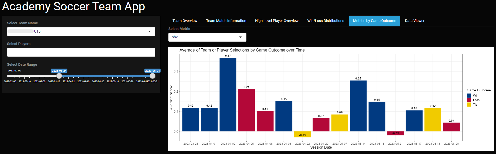

# Data Science and Analytics Portfolio

---

## Sport Science and Performance Analysis Projects

[Boys Academy Soccer Team App](/soccer_app_page.md)

<small>Project completed for Development Academy boys' soccer teams to give the Sports Scientist the ability to visualize game level data based on the team selected. This RShiny App provides the opportunity for the client to look at team level metrics as well as filter for specific player performance. Additionally it provides the distributions of KPIs based on game outcome and
the option to view the underlying dataset based on the applied filters.</small>

---
[Collegiate Men's Basketball Team KPI Reporting](/mens_bball_project.md)

<small>Project completed for a DI collegiate Mens Basketball Team with the purpose of identifying and flagging players who may be physically unprepared for the game and therefore at an increased risk of injury due to fatigue.</small>

---
[Intersection of Sports Science & Game Performance for Elite Collegiate Women's Basketball Team](/WBB_Performance_Analysis.md)

<small>This project explored how and what Sports Science metrics have a significant relationship with in-game performance in order to benchmark a Womens Basketball Team's performance across a season.</small>

---

## Sports Analytics Projects

[Predicting Player Impact in NBA Games](/human_performance_analytics_project.md)

<small>Machine Learning project to predict the true impact of an NBA player on eventual game outcome using point differential. This was a group project completed as part of the Human Performance Analytics class that I had the opportunity to take in my undergrad education at the University of Notre Dame.</small>

---
[Super Team or Super Dream?](/pdf/NBA_ML_Analysis.pdf)

<small>Machine Learning project to predict an NBA's team wins in the upcoming season (at the time of analysis it was about to be the 21-22 season) based on updated rosters from off-season player movement. The GitHub Repository with more detailed project information can be [found here.](https://github.com/jadegosar/Predicting_NBA_Team_Wins)</small>

---
[NBA Shot Efficiency Dashboard in Tableau](https://github.com/jadegosar/Tableau_Projects)

<small>Tableau dashboard to visualize NBA player shot profiles with ability to filter for specific parameters and shooting efficiency based on away and home games played in a season.</small>

---
[Miles Traveled by Athletes Exploration](https://github.com/jadegosar/Team_Miles_Traveled)

<small>Utilized various libraries in R, specifically the geosphere and geodist packages, to create metrics that determined how many meters were traveled per competition for each sports team in a database.</small>

---

## Projects in Python

[Webpage Scraping](https://github.com/jadegosar/Python_Projects)

<small>Webpage scraping script to gather schedule information for sports teams within a D1 collegiate athletics program.</small>

---
[Converting PDFs to Structured Data](https://github.com/jadegosar/Python_Projects)

<small>Script that pulls individual and team in-game performance metrics and statistics from PDF inputs.</small>

---
[Football Project placeholder](/pdf/sample_presentation.pdf)

<small>In progress project for collegiate Football Team to determine what metrics differentiate players who went to the NFL from all other players in the program at a positional level.</small>

---
[Recipe Manager Program](https://github.com/jadegosar/Recipe_Manager_Interface)

<small>Program that can be used to create, store, organize and manage a recipe book created for a course in 'Python Programming'.</small>

---

## Business Analytics and KPI Reporting

[Maverik Case Competition](/pdf/Maverik_Project_Presentation.pdf)

<small>As part of the final Capstone course in the University of Utah’s MS in Business Analytics program, my team competed in a Maverik-sponsored case competition focused on forecasting first-year sales for new stores across four major product categories. Our team ultimately placed second among all MSBA program teams and the GitHub Repository with more detailed project information can be [found here.](https://github.com/jadegosar/Maverik-Case-Competition)</small>

---
[Determining Default Risk for Loan Company](/pdf/Home_Credit_Presentation.pdf)

<small>The objective of this project was to create a supervised analytical model to help Home Credit predict how capable each applicant is of repaying a possible loan, giving them the ability to intervene before borrowers default and reach an underserved population. We developed and tuned a Random Forest model that outperformed the majority classifier, yielding an estimated $505M increase in ROI. The GitHub Repository with more detailed project information can be [found here.](https://github.com/jadegosar/Home_Credit_Default_Risk)</small>

---
[Forbes Top 2000 Companies of 2017 Dashboard](https://github.com/jadegosar/Tableau_Projects)

<small>Project completed in Tableau to generate insights from the companies represented in the Forbes Global 2000 which ranks the top 2000 public companies in the world.</small>

---
[Text Analytics Project](https://github.com/jadegosar/World_Cup_Tweets)

<small>Text Analytics project to contextualize important topics and sentiment throughout the Men's World Cup in 2022 by analyzing tweets related to the World Cup.</small>

---
[Machine Learning Class Project](https://github.com/jadegosar/ML_Class_Project)

<small>Final project completed as a part of the MSBA program at Utah to create a supervised Machine Learning model given a specific business situation.</small>

---
[Data Best Practices Presentation](/pdf/Data_Collection_and_Cleaning_Presentation.pdf)

<small>Presentation given to peers in the Applied Health and Performance Science internship program on the topic of data collection and data cleaning relating to Sports Science data sources specifically.</small>

---

---

<!-- Remove above link if you don't want to attibute -->
