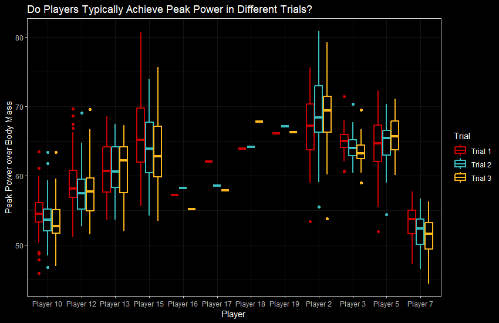

## Project for Men's Basketball Team KPI Analysis

**Project description:** This project was completed for a collegiate men's basketball team with the ultimate goal of creating an application or UI that can be used by the Sport Performance team, particularly the Strength and Conditioning coaches. This interface would be used to inform decisions made around athlete injury risk based on fatigue on an individualized basis and if any interventions are needed to the training programs of a particular athlete. The objectives of this project were to make athlete monitoring easier for coaches and other performance staff as well as mitigate injury risk because it will provide a more objective indicator of when an athlete may be fatigued. Additionally, our hope was this analysis would allow the performance staff and coaches to better understand the physical toll that practices and games have on the athletes, which in turn can be used to offer advice on how to adjust plans to mitigate athlete injury risk or flag those who might perform under their standard due to fatigue.

### 1. Data Description

The data sources used for this project were:

*Force Plate Data:* Data was collected from countermovement jumps that were performed on Vald Forcedecks twice a week. The initial step in this project was research focused on finding evidence that backed up associations between fatigue and variables we had access to from the countermovement jumps. The intention of this step was to determine the variables of interest in the analysis based on basketball specific research so that we could make a more manageable dataset from the ~200 variables that were available in the initial export. In our Principal Component Analysis of the Force Plate data, we were able to determine that 12 variables covered 92% of the variance in all of the data so we felt confident in our decision to reduce the number of variables to something very close to that number.

*Strive Data:* Data collected from Strive technology used EMG sensors in the athlete's shorts to provide various metrics of interest, many that represent accelerometer or muscle load measures. Due to the fact that we wanted to look at the physical toll that practices had on the athletes and inform decision-making leading up the game, we did not use data collected from the day of the competition.

*Schedule Information:* Schedule information was used to map which Force Plate sessions and Strive files were collected during game weeks and create a variable that determined how many days before or after a game each session was. This was used to map sessions that fell within 3 days to specific games in order to...

*Minutes Played:* We used a file provided by the Applied Health and Performance Science department to determine the number of minutes every player was on the court in each game. This enabled us to set a minimum threshold for minutes played in a game...

*In-game metrics and player statistics:* These metrics were provided to us by a statistician that works with the basketball team in PDF format. From these inputs we were able to pull individual player plus/minuses per game as well as the overall team plus/minus. The plus/minus values we worked with were not the standard calculation for plus/minus as they were created using a formula that weighted certain metrics higher than others to calculate a number of "positive points" added and "negative points" which would be subtracted from the positive points to generate the plus/minus metric. We did not have a lot of visibility into the exact formula that calculated positive and negative points as they were generated using a propietary program created by the team's statistician but recieved feedback that this plus/minus was the preferred advanced statistic that the staff used to evaluate in-game performance. Ultimately, this allowed us to benchmark what games each athlete performed above their average plus/minus across the season along with when the team played particularly well or poorly irregardless of the outcome of the game.

### 2. Project Process

* Research sports performance related to men's basketball at a collegiate and professional level
* Clean and aggregate Sports Science data sources
* Exploratory data analysis of various data sources and data manipulation
* Trial Analysis
* Load Comparison and Analysis
* Regression modeling
* Statistical significance testing
* Determining Key Performance Indicators
* Creation of PowerBI dashboard
* Final conclusions and presentation to Sports Science and Performance Staff

### 3. Analysis in R Studio

**Exploratory Data Analysis**

**Force Plate Trial Analysis**

The purpose of the trial analysis was to establish the best way to represent an athlete's best effort and ability on a given test date. We knew that averaging across a given day or just taking the trial where one metric was at its maximum would not accomplish this so we decided to look at if the variables we were primarily interested in typically fell in the same trial or not.

**Strive Load Comparison and Analysis**

**Regression Modeling**

**Statistical Significance Testing**

**Determining Key Performance Indicators**

### 4. Final Deliverables

**Creation of PowerBI dashboard**

**Final Conclusions and Presentation**

For more details on the code related to this project see my [Men's Basketball GitHub Repository](https://github.com/jadegosar/Collegiate_MBB_KPI_Reporting).
