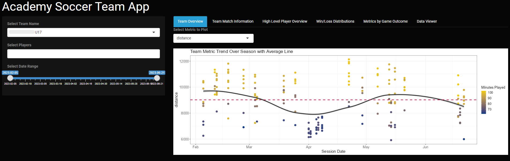
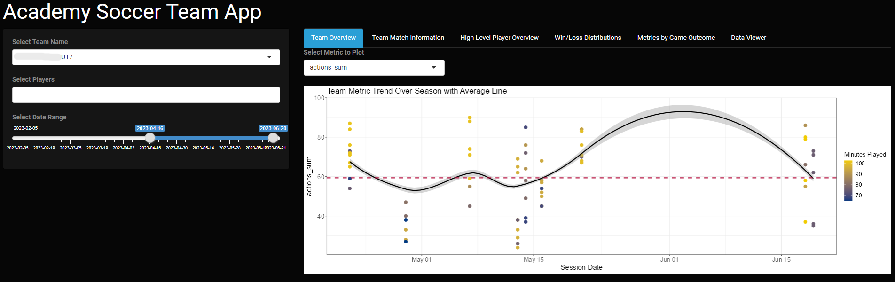
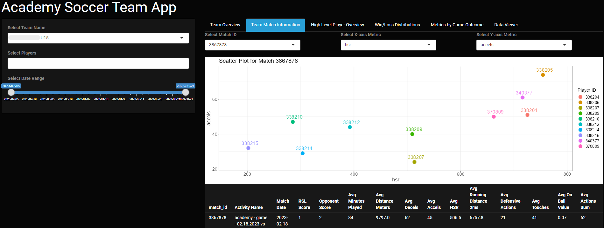
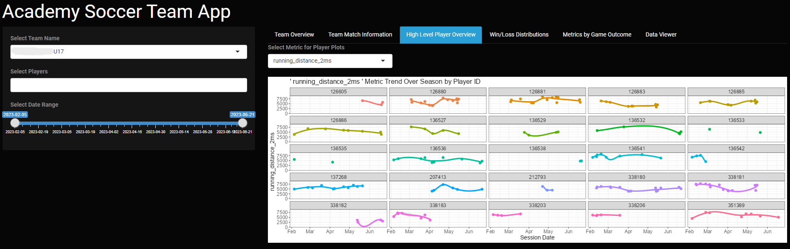
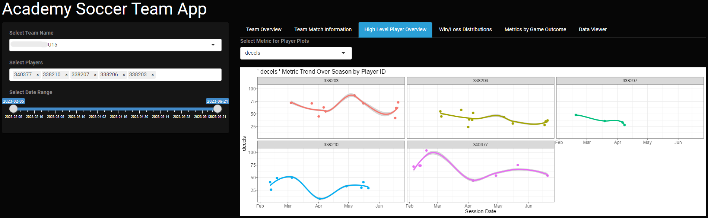
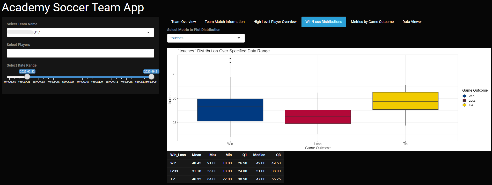
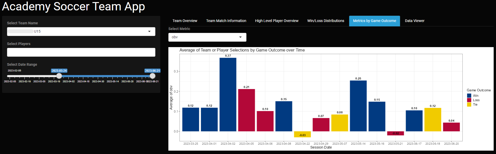
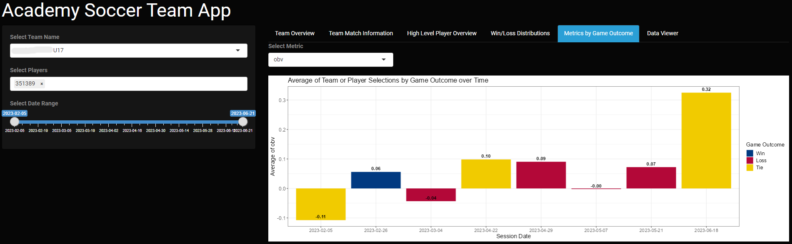

## RShiny App to visualize a Soccer Team's Performance over the course of a Season

**Project description:** This project was completed for the performance coach of an elite youth soccer club. The dataset that was provided was summarized event and GPS data for the six month season ranging from January to June at the indiviudal player level. The objective of the project was to build a Shiny app that allowed for the client to visualize data on a player and team level and the requirements were to have the ability to select players along with a regression line of trends over the season.

### 1. Data Description

The dataset contains columns containing the following information:
* player_id
* team_name
* activity_name
* match_id
* session_date - match date
* cat_min_played - minutes played from GPS
* distance - distance covered in meters
* decels - amount of decelerations
* accels - amount of accelerations
* hsr - high speed running yards (distance above 18 km/h)
* running_distance_2ms - distance covered over 2 m/s
* def_act - sum of tackles, pressure, foul
* touches - amount of ball receptions
* obv - sum on ball value
* actions_sum - def_act + touches
* team_score - goals scored by home team
* opp_score - goals scored by opponent

### 2. Application Functionality

This app gives the user the ability to select the team name to visualize the data for, filter for up to five specific players, and select a date range to be included in the output. The app has 6 tabs: Team Overview, Team Match Information, High Level Player Overview, Win/Loss Distributions, Metrics by Game Outcome, and Data Viewer. Each tab's functionality is outlined below.

*Team Overview:*
The team overview tab plots team level data over the season, allowing the user to select a metric to visualize. The plot includes a regression line as well as a line that represents the team average of that metric over the date range specified. The data points are colored by the number of minutes the athlete played in the game to provide context to the range of values shown. This visualization cannot be filtered to the indiviudal player level as it is meant to give a high level overview of the trends present in the data at the team level.

*Team Match Information:*
The team match information tab contains a scatterplot that shows the relationship between two selected metrics for an individual game. The user can select a team and any match id that is associated with that team along with what metrics they would like to display on the x and y axis. This tab also shows a summary table for the match selected that displays averages across the team for all metrics in the dataset.

*High Level Player Overview:*
High Level Player Overview plots the selected metric for each player on the team over the season. This visualization can be filtered for up to five players to provide a side by side comparison of trends in these KPI's at the individual level and the date range of the line graphs can be filtered to the user's preference.

*Win/Loss Distributions:*
This tab contains a boxplot that shows the range of a metric based on whether the game outcome was a win, loss, or tie. The plot can be filtered for a desired date range and provides a summary table of basic statistics on the distribution of the metric depending on the game outcome. Additionally, this output can be filtered to a specific player or group of players.

*Metrics by Game Outcome:*
Metrics by Game Outcome visualizes the selected metric based on the game outcome. This gives the user the ability to see what the team or players performance was in an individual metric and how that might relate to the eventual outcome of the game.

*Data Viewer:*
The final tab in the application displays the data based on the filters that the user has specified for the team name, player ids, and date range. This allows the user to see the underlying dataset if they want to examine any observations at the most granular level.

### 3. Application User Interface

For more details on the code used to create the application see my [GitHub Repository](https://github.com/jadegosar/Game_Data_App).
